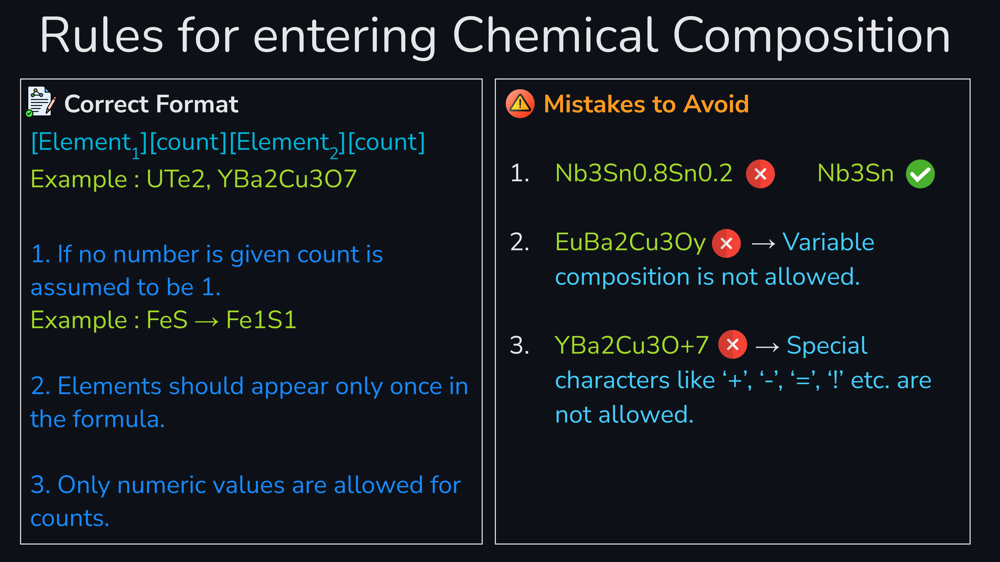

# Accelerating-Search-of-Superconductors

<div align="center">
    
</div>


[](https://www.python.org/downloads/release/python-310/)
[](https://arxiv.org/abs/your-paper-id)
  
  

## Description

This repository contains code used for my project: *Machine Learning-based Critical Temperature Predictions in Superconductors*. 

## Requirements

- **Python 3.10+** is required. You can check your Python version using:

  ```bash
  python --version

## Usage

- Clone this repository to your local machine.

  ```bash
  git clone https://github.com/adigasuhas/Accelarating-Search-for-Superconductors-using-Machine-Learning.git

- Navigate to the Code Directory
  Change into the working directory where the Tc prediction scripts are located:

```bash
cd Accelarating-Search-for-Superconductors-using-Machine-Learning/Temp_Predictor

- Prepare the Input File

- Open the file named `Temp_prediction_materials.csv`.

- Add the materials (chemical compositions) for which you wish to predict the critical temperature (Tc).

- Follow the formatting rules illustrated in the reference image provided in the repository to ensure your input is valid.

<div align="center">
    
</div>

- The following columns can be handled as described:

  - **Material-ID**: This is for user reference and identification. It is not auto-filled by the code, so you may enter any identifier (e.g., Unique Identification number, Sample name).

  - **Temp-critical**: If known, you may enter the experimental $T_c$ here for comparison. Otherwise, you may leave it blank.

